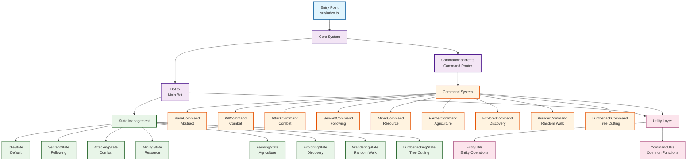

# 🤖 Mineflayer Bot プロジェクト詳細仕様書

## 📋 目次
1. [プロジェクト概要](#プロジェクト概要)
2. [アーキテクチャ設計](#アーキテクチャ設計)
3. [ディレクトリ構造](#ディレクトリ構造)
4. [コアシステム](#コアシステム)
5. [State Pattern実装](#state-pattern実装)
6. [Command Pattern実装](#command-pattern実装)
7. [ユーティリティクラス](#ユーティリティクラス)
8. [設定・環境管理](#設定・環境管理)
9. [デプロイメント](#デプロイメント)
10. [API Reference](#api-reference)

---

## プロジェクト概要

### 🎯 概要
TypeScriptとMineflayerライブラリを使用して構築された、高度なMinecraft自動化ボットシステムです。State PatternとCommand Patternを核とした設計により、拡張性と保守性を重視した実装となっています。

### 🔧 技術スタック
- **言語**: TypeScript 5.x
- **実行環境**: Node.js
- **主要ライブラリ**: 
  - `mineflayer` (Minecraft bot framework)
  - `mineflayer-pathfinder` (pathfinding)
  - `prismarine-entity` (entity management)
  - `minecraft-data` (game data)
  - `vec3` (3D vector operations)
- **開発ツール**: Docker, Docker Compose
- **環境管理**: dotenv

### 🏗️ 設計原則
1. **単一責任の原則 (SRP)**: 各クラスは1つの責任のみを持つ
2. **開放閉鎖の原則 (OCP)**: 拡張に開放的、修正に閉鎖的
3. **依存性逆転の原則 (DIP)**: 抽象に依存し、具象に依存しない
4. **State Pattern**: 状態管理の複雑さを解決
5. **Command Pattern**: 操作のカプセル化

---

## アーキテクチャ設計

### 🏛️ 全体アーキテクチャ



### 🔄 データフロー
1. **エントリーポイント** (`index.ts`) でボット初期化
2. **Bot** クラスがMineflayerクライアントを管理
3. **CommandHandler** がチャットコマンドを解析・実行
4. **State** がボットの行動を制御
5. **Command** が即座の操作を実行
6. **Utils** が共通機能を提供

---

## ディレクトリ構造

```
minecraft-bot/
├── src/                          # TypeScriptソースコード
│   ├── index.ts                  # エントリーポイント
│   ├── core/                     # コアシステム
│   │   ├── Bot.ts               # メインボットクラス
│   │   └── CommandHandler.ts    # コマンドハンドラー
│   ├── states/                   # 状態管理 (State Pattern)
│   │   ├── IBotState.ts         # 状態インターフェース
│   │   ├── IdleState.ts         # 待機状態
│   │   ├── ServantState.ts      # 追従状態
│   │   ├── AttackingState.ts    # 戦闘状態
│   │   ├── MiningState.ts       # 採掘状態
│   │   ├── FarmingState.ts      # 農業状態
│   │   ├── ExploringState.ts    # 探索状態
│   │   ├── WanderingState.ts    # 放浪状態
│   │   ├── LumberjackingState.ts # 伐採状態
│   │   ├── MovingState.ts       # 移動状態
│   │   └── FollowingState.ts    # フォロー状態
│   ├── commands/                 # コマンドシステム (Command Pattern)
│   │   ├── ICommand.ts          # コマンドインターフェース
│   │   ├── BaseCommand.ts       # 基底コマンドクラス
│   │   ├── KillCommand.ts       # 攻撃コマンド
│   │   ├── AttackCommand.ts     # 戦闘コマンド
│   │   ├── ServantCommand.ts    # 追従コマンド
│   │   ├── MinerCommand.ts      # 採掘コマンド
│   │   ├── FarmerCommand.ts     # 農業コマンド
│   │   ├── ExplorerCommand.ts   # 探索コマンド
│   │   ├── WanderCommand.ts     # 放浪コマンド
│   │   ├── LumberjackCommand.ts # 伐採コマンド
│   │   ├── DropCommand.ts       # アイテム廃棄コマンド
│   │   ├── GiveCommand.ts       # アイテム付与コマンド
│   │   └── PlaceCommand.ts      # ブロック設置コマンド
│   └── utils/                    # ユーティリティクラス
│       ├── EntityUtils.ts       # エンティティ操作
│       └── CommandUtils.ts      # コマンド共通機能
├── dist/                         # コンパイル済みJavaScript
├── node_modules/                 # npm dependencies
├── .env.example                  # 環境変数テンプレート
├── package.json                  # Node.js設定
├── tsconfig.json                 # TypeScript設定
├── Dockerfile                    # Docker設定
├── docker-compose.yml            # Docker Compose設定
├── README.md                     # プロジェクト説明
├── NOTE.md                       # 学習ノート
├── DOCS.md                       # 本ドキュメント
└── test_refactored_states.md     # テスト仕様
```

---

## コアシステム

### 🎮 1. エントリーポイント (`src/index.ts`)

アプリケーションのエントリーポイントファイルです。環境変数の読み込み、ボットの初期化、コマンドの登録、イベントリスナーの設定を行います。

**主な機能:**
- **環境変数管理**: `.env`ファイルから接続設定を読み込み
- **ボット初期化**: `Bot`クラスのインスタンス作成
- **コマンド登録**: 25個以上のコマンドを`CommandHandler`に登録
- **イベント処理**: チャット、スポーン、エラーイベントの処理
- **グレースフルシャットダウン**: SIGINT/SIGTERMでの適切な終了処理

**コード構造:**
```typescript
// 環境変数から設定を読み込み
const options: BotOptions = {
  host: process.env.MC_HOST || "localhost",
  port: parseInt(process.env.MC_PORT || "25565", 10),
  username: process.env.MC_USERNAME || "Bot",
  auth: (process.env.MC_AUTH as "offline" | "microsoft") || "offline",
  version: process.env.MC_VERSION || "1.20.1",
};

// ボットとコマンドハンドラーの作成
const bot = new Bot(options);
const commandHandler = new CommandHandler(options.username);

// 全コマンドの登録
commandHandler.registerCommand("stop", new StopCommand());
commandHandler.registerCommand("idle", new IdleCommand());
// ... 他25個以上のコマンド登録
```

### 🎮 2. Botクラス (`src/core/Bot.ts`)

メインのボットクラスで、Mineflayerボットのライフサイクルと状態管理を担当します。

**主な機能:**
- **Mineflayerボット管理**: 接続、認証、基本設定
- **State Pattern実装**: 状態遷移の安全な管理
- **Pathfinder統合**: 移動システムの初期化
- **メインループ**: 0.1秒間隔での状態実行
- **エラーハンドリング**: 接続エラーやキックの処理

**重要なメソッド:**
```typescript
// 状態変更の安全な管理
public changeState(newState: IBotState): void {
  if (this.currentState) {
    this.currentState.exit(); // 現在の状態を終了
  }
  this.currentState = newState;
  this.currentState.enter(); // 新しい状態を開始
}

// メインループで状態を実行
public update(): void {
  if (this.currentState) {
    this.currentState.execute();
  }
}
```

**設計のポイント:**
1. **カプセル化**: Mineflayerボットの複雑さを隠蔽
2. **状態管理**: 安全で予測可能な状態遷移
3. **エラー処理**: 堅牢なエラーハンドリング
4. **拡張性**: 新しい機能を簡単に追加可能

### 🎮 3. CommandHandlerクラス (`src/core/CommandHandler.ts`)

チャットメッセージの解析とコマンドの実行を管理するクラスです。Command Patternの管理者として機能します。

**主な機能:**
- **コマンド登録管理**: 動的なコマンドの登録・解除
- **メッセージ解析**: メンション形式のチャットメッセージを解析
- **コマンド実行**: 安全なコマンド実行とエラーハンドリング
- **ヘルプ生成**: 利用可能なコマンドの一覧表示

**メッセージ解析ロジック:**
```typescript
// メンション形式のパターンマッチング
const mentionPattern = new RegExp(`^@(${this.botName}|all)\\s+(.+)$`, "i");
const match = trimmedMessage.match(mentionPattern);

// 例: "@Bot attack zombie" → ["@Bot attack zombie", "Bot", "attack zombie"]
//     "@all idle" → ["@all idle", "all", "idle"]
```

**コマンド実行フロー:**
1. メッセージがメンション形式か確認
2. コマンド名と引数を分離
3. 登録されたコマンドを検索
4. 見つかった場合は実行、見つからない場合はエラーメッセージ

**エラーハンドリング:**
- 未知のコマンド処理
- 実行時エラーの捕捉
- ユーザーフレンドリーなエラーメッセージ

---

## State Pattern実装

### 🔄 状態管理の概要

本プロジェクトではState Patternを使用して、ボットの複雑な行動パターンを管理しています。各状態は`IBotState`インターフェースを実装し、状態固有の動作を定義します。

### 🎯 4. IBotStateインターフェース (`src/states/IBotState.ts`)
全ての状態クラスが実装する基底インターフェースです。State Patternの核となる部分です。

**インターフェース定義:**
```typescript
export interface IBotState {
  enter(): void;    // 状態開始時の初期化
  exit(): void;     // 状態終了時のクリーンアップ
  execute(): void;  // 定期実行処理
  getName(): string; // 状態名の取得
}
```

**設計の特徴:**
- **ライフサイクル管理**: 状態の開始・終了・実行を明確に分離
- **型安全性**: TypeScriptの型システムを活用
- **一貫性**: 全ての状態で同じインターフェースを保証

### 🔄 5. 具体的な状態クラス

#### 🏠 IdleState（待機状態）
ボットのデフォルト状態で、コマンドを待機している状態です。

**主な特徴:**
- **Singleton Pattern**: Bot毎に1つのインスタンスを管理
- **クリーンアップ**: 移動や攻撃を停止
- **拡張性**: 将来的にヘルスチェックなど追加可能

**実装のポイント:**
```typescript
// Bot毎のSingletonパターン
private static instances: Map<string, IdleState> = new Map();

public static getInstance(bot: Bot): IdleState {
  const botName = bot.getName();
  if (!IdleState.instances.has(botName)) {
    IdleState.instances.set(botName, new IdleState(bot));
  }
  return IdleState.instances.get(botName)!;
}
```

#### 🤖 ServantState（追従状態）
指定されたマスターを追従し、脅威を検出して自動的に戦闘状態に遷移する高度な状態です。

**主な機能:**
- **マスター追従**: 指定プレイヤーを自動追従
- **脅威検出**: 敵対Mobを自動検出（0.5秒間隔）
- **戦闘委譲**: 脅威発見時にAttackingStateに遷移
- **ダメージ監視**: マスターやボット自身への攻撃を監視

**敵対Mob判定の最適化:**
```typescript
// Mineflayerの公式kindプロパティを使用
private isHostileMob(entity: Entity): boolean {
  return entity.kind === 'Hostile mobs';
}

// nearestEntityを使った効率的な検索
private findNearestHostileMob(): Entity | null {
  const hostileMob = this.bot.mc.nearestEntity((entity) => {
    if (!entity || !entity.position || !entity.isValid) return false;
    
    const distance = this.bot.mc.entity.position.distanceTo(entity.position);
    if (distance > detectionRange) return false;
    
    return this.isHostileMob(entity);
  });
  
  return hostileMob || null;
}
```

**状態遷移の管理:**
```typescript
// 脅威発見時の委譲
private delegateToAttackingState(target: Entity): void {
  const attackingState = new AttackingState(this.bot, target, this);
  this.bot.changeState(attackingState);
}
```

#### ⚔️ AttackingState（戦闘状態）
指定されたエンティティを攻撃し続ける専用の状態です。親状態管理により、戦闘終了後に元の状態に戻ることができます。

**主な機能:**
- **ターゲット追跡**: 移動するターゲットを追跡
- **攻撃実行**: 0.6秒間隔でのクールダウン付き攻撃
- **距離管理**: 4ブロック以内で攻撃、それ以上は追跡
- **親状態管理**: 戦闘終了後に元の状態に復帰

**重要な設計要素:**
```typescript
// 親状態管理によるフレキシブルな状態遷移
constructor(bot: Bot, target: Entity, parentState?: IBotState) {
  this.parentState = parentState || null;
}

// 戦闘終了時の適切な状態遷移
if (this.parentState) {
  this.bot.changeState(this.parentState);
} else {
  this.bot.changeStateToIdle();
}
```

**効率的な移動制御:**
```typescript
// ターゲットの位置変化を監視
private hasTargetMovedSignificantly(): boolean {
  const distance = Math.sqrt(
    Math.pow(this.target.position.x - this.lastTargetPosition.x, 2) +
    Math.pow(this.target.position.y - this.lastTargetPosition.y, 2) +
    Math.pow(this.target.position.z - this.lastTargetPosition.z, 2)
  );
  return distance > this.positionUpdateThreshold;
}
```

#### 🔨 その他の状態クラス

**MiningState（採掘状態）**
- 指定されたブロックタイプを自動採掘
- 採掘効率の最適化
- インベントリ管理

**FarmingState（農業状態）**
- 作物の植え付け・収穫
- 水源の管理
- 種の補充

**ExploringState（探索状態）**
- 未探索エリアの発見
- 構造物の検出
- マップ情報の記録

**WanderingState（放浪状態）**
- ランダムな移動
- 障害物の回避
- 定期的な方向変更

**LumberjackingState（伐採状態）**
- 木の自動伐採
- 苗木の植え付け
- 効率的な伐採パターン

---

## Command Pattern実装

### 🎯 コマンドシステムの概要

Command Patternを使用して、ユーザーからの指示を実行可能なコマンドオブジェクトとして管理します。各コマンドは`ICommand`インターフェースを実装し、統一された実行インターフェースを提供します。

### 🔧 6. ICommandインターフェース (`src/commands/ICommand.ts`)
全てのコマンドクラスが実装する基底インターフェースです。Command Patternの核となる部分です。

**インターフェース定義:**
```typescript
export interface ICommand {
  execute(bot: Bot, username: string, args: string[]): Promise<void>;
  getName(): string;
  getDescription(): string;
  getUsage(): string;
}
```

**設計の特徴:**
- **統一されたインターフェース**: 全てのコマンドが同じ方法で実行される
- **非同期処理**: async/await対応
- **メタデータ**: 名前、説明、使用法の提供
- **型安全性**: TypeScriptによる型チェック

### 🔧 7. BaseCommandクラス (`src/commands/BaseCommand.ts`)

コマンドの基底クラスで、共通機能とエラーハンドリングを提供します。

**主な機能:**
- **Template Method Pattern**: 共通処理の抽象化
- **エラーハンドリング**: 統一されたエラー処理
- **引数検証**: 共通的な引数検証ヘルパー
- **ログ出力**: 実行ログの統一化

**実装パターン:**
```typescript
// Template Method Pattern の実装
public async execute(bot: Bot, username: string, args: string[]): Promise<void> {
  try {
    CommandUtils.logCommandExecution(bot, this.getName(), username, args);
    await this.executeCommand(bot, username, args); // 子クラスで実装
  } catch (error) {
    CommandUtils.handleCommandError(bot, this.getName(), error);
  }
}

// 子クラスで実装する抽象メソッド
protected abstract executeCommand(bot: Bot, username: string, args: string[]): Promise<void>;
```

**ヘルパーメソッド:**
```typescript
// 引数数の検証
protected validateArgumentCount(args: string[], expectedCount: number, bot: Bot): boolean

// 引数範囲の検証
protected validateArgumentRange(args: string[], minCount: number, maxCount: number, bot: Bot): boolean

// 数値解析
protected parseNumber(value: string, paramName: string, bot: Bot): number | null
```

### 🔧 8. 具体的なコマンドクラス

#### ⚔️ 戦闘系コマンド

**KillCommand（キルコマンド）**
```typescript
// 使用例: @Bot kill zombie
export class KillCommand extends BaseCommand {
  protected async executeCommand(bot: Bot, username: string, args: string[]): Promise<void> {
    if (!this.validateArgumentCount(args, 1, bot)) return;
    
    const targetName = args[0];
    const targets = EntityUtils.findNearbyEntitiesByName(bot, targetName);
    
    if (targets.length === 0) {
      bot.sendMessage(`対象 "${targetName}" が見つかりません`);
      return;
    }
    
    const target = EntityUtils.findClosestEntity(bot, targets);
    const currentState = bot.getCurrentState();
    
    // AttackingStateに遷移し、現在の状態を親状態として設定
    bot.changeState(new AttackingState(bot, target, currentState));
    
    bot.sendMessage(`${EntityUtils.getEntityDisplayName(target)} を攻撃開始`);
  }
}
```

**AttackCommand（攻撃コマンド）**
- KillCommandと同様の機能
- 異なるコマンド名での同じ操作

#### 🤖 状態遷移コマンド

**ServantCommand（追従コマンド）**
```typescript
// 使用例: @Bot servant PlayerName
export class ServantCommand extends BaseCommand {
  protected async executeCommand(bot: Bot, username: string, args: string[]): Promise<void> {
    const masterName = args.length > 0 ? args[0] : username;
    bot.changeState(new ServantState(bot, masterName));
    bot.sendMessage(`${masterName} を追従します`);
  }
}
```

**IdleCommand（待機コマンド）**
```typescript
// 使用例: @Bot idle
export class IdleCommand extends BaseCommand {
  protected async executeCommand(bot: Bot, username: string, args: string[]): Promise<void> {
    bot.changeStateToIdle();
    bot.sendMessage("待機状態になりました");
  }
}
```

#### 🏭 作業系コマンド

**MinerCommand（採掘コマンド）**
```typescript
// 使用例: @Bot miner diamond_ore
export class MinerCommand extends BaseCommand {
  protected async executeCommand(bot: Bot, username: string, args: string[]): Promise<void> {
    const blockType = args.length > 0 ? args[0] : 'stone';
    bot.changeState(new MiningState(bot, blockType));
    bot.sendMessage(`${blockType} の採掘を開始します`);
  }
}
```

**FarmerCommand（農業コマンド）**
```typescript
// 使用例: @Bot farmer wheat
export class FarmerCommand extends BaseCommand {
  protected async executeCommand(bot: Bot, username: string, args: string[]): Promise<void> {
    const cropType = args.length > 0 ? args[0] : 'wheat';
    bot.changeState(new FarmingState(bot, cropType));
    bot.sendMessage(`${cropType} の農業を開始します`);
  }
}
```

#### 🧭 移動・探索系コマンド

**ExplorerCommand（探索コマンド）**
```typescript
// 使用例: @Bot explorer 100
export class ExplorerCommand extends BaseCommand {
  protected async executeCommand(bot: Bot, username: string, args: string[]): Promise<void> {
    const range = this.parseNumber(args[0] || '50', 'range', bot) || 50;
    bot.changeState(new ExploringState(bot, range));
    bot.sendMessage(`半径 ${range} ブロックの探索を開始します`);
  }
}
```

**WanderCommand（放浪コマンド）**
```typescript
// 使用例: @Bot wander
export class WanderCommand extends BaseCommand {
  protected async executeCommand(bot: Bot, username: string, args: string[]): Promise<void> {
    bot.changeState(new WanderingState(bot));
    bot.sendMessage("放浪を開始します");
  }
}
```

#### 🔧 アイテム・インベントリ系コマンド

**GiveCommand（アイテム付与コマンド）**
```typescript
// 使用例: @Bot give PlayerName diamond 5
export class GiveCommand extends BaseCommand {
  protected async executeCommand(bot: Bot, username: string, args: string[]): Promise<void> {
    if (!this.validateArgumentRange(args, 2, 3, bot)) return;
    
    const targetPlayer = args[0];
    const itemName = args[1];
    const amount = this.parseNumber(args[2] || '1', 'amount', bot) || 1;
    
    // アイテム付与ロジック
    CommandUtils.giveItemToPlayer(bot, targetPlayer, itemName, amount);
  }
}
```

**DropCommand（アイテム廃棄コマンド）**
```typescript
// 使用例: @Bot drop dirt 10
export class DropCommand extends BaseCommand {
  protected async executeCommand(bot: Bot, username: string, args: string[]): Promise<void> {
    if (!this.validateArgumentRange(args, 1, 2, bot)) return;
    
    const itemName = args[0];
    const amount = this.parseNumber(args[1] || '1', 'amount', bot) || 1;
    
    // アイテム廃棄ロジック
    CommandUtils.dropItems(bot, itemName, amount);
  }
}
```

---

## ユーティリティクラス

### 🔧 9. EntityUtilsクラス (`src/utils/EntityUtils.ts`)
エンティティ関連のユーティリティ関数を提供します。主にエンティティの検索、フィルタリング、ソートを行います。

**主な機能:**
- **近くのエンティティ検索**: 半径指定でのエンティティ検索
- **名前によるエンティティフィルタ**: 指定名前のエンティティをフィルタリング
- **最も近いエンティティの特定**: 距離に基づくエンティティのソートと選択

**重要なメソッド:**
```typescript
// 半径内のエンティティを取得
export function findNearbyEntities(bot: Bot, radius: number): Entity[] {
  return Object.values(bot.entities).filter((entity) => {
    return entity.position.distanceTo(bot.entity.position) <= radius;
  });
}

// 名前でフィルタリング
export function findNearbyEntitiesByName(bot: Bot, name: string): Entity[] {
  return findNearbyEntities(bot, 64).filter((entity) => entity.name === name);
}

// 最も近いエンティティを取得
export function findClosestEntity(bot: Bot, entities: Entity[]): Entity | null {
  if (entities.length === 0) return null;
  
  entities.sort((a, b) => {
    const distanceA = a.position.distanceTo(bot.entity.position);
    const distanceB = b.position.distanceTo(bot.entity.position);
    return distanceA - distanceB;
  });
  
  return entities[0];
}
```

**敵対Mob判定:**
```typescript
// 包括的な敵対Mobリスト
const hostileTypes = [
  'zombie', 'skeleton', 'creeper', 'spider', 'enderman', 'witch',
  'slime', 'magma_cube', 'blaze', 'ghast', 'wither_skeleton',
  'husk', 'stray', 'phantom', 'drowned', 'pillager', 'vindicator',
  'evoker', 'ravager', 'vex', 'silverfish', 'endermite',
  'guardian', 'elder_guardian', 'shulker', 'hoglin', 'zoglin',
  'piglin_brute', 'warden'
];
```

### 🔧 10. CommandUtilsクラス (`src/utils/CommandUtils.ts`)

コマンド実行時の共通機能とエラーハンドリングを提供するユーティリティクラスです。

**主な機能:**
- **エラーハンドリング**: 統一されたエラー処理
- **引数検証**: 数や範囲の検証
- **数値解析**: 文字列から数値への変換
- **ログ出力**: 実行ログの記録

**重要なメソッド:**
```typescript
// 統一されたエラーハンドリング
public static handleCommandError(
  bot: Bot,
  commandName: string,
  error: unknown,
  customMessage?: string
): void {
  console.error(`[${bot.getName()}] Error in ${commandName} command:`, error);
  
  const errorMessage = customMessage || 
    `${commandName}コマンドの実行中にエラーが発生しました: ${
      error instanceof Error ? error.message : 'Unknown error'
    }`;
  
  bot.sendMessage(errorMessage);
}

// 引数の数を検証
public static validateArgumentCount(
  args: string[],
  expectedCount: number,
  usage: string,
  bot: Bot
): boolean {
  if (args.length < expectedCount) {
    bot.sendMessage(`使用法: ${usage}`);
    return false;
  }
  return true;
}

// 数値引数を解析・検証
public static parseNumber(value: string, paramName: string, bot: Bot): number | null {
  const parsed = parseInt(value, 10);
  if (isNaN(parsed)) {
    bot.sendMessage(`${paramName}は有効な数値で指定してください。`);
    return null;
  }
  return parsed;
}
```

**DRY原則の実践:**
- 重複コードの排除
- 共通エラーハンドリング
- 統一されたメッセージフォーマット

---

## 設定・環境管理

### 🔧 11. 環境設定ファイル

#### package.json
```json
{
  "name": "mineflayer-bot",
  "version": "2.0.0",
  "description": "A versatile Minecraft bot built with TypeScript and design patterns",
  "main": "dist/index.js",
  "scripts": {
    "build": "tsc",
    "start": "node dist/index.js",
    "dev": "tsc && node dist/index.js",
    "clean": "rm -rf dist"
  },
  "dependencies": {
    "dotenv": "^16.6.1",
    "minecraft-data": "^3.51.0",
    "mineflayer": "^4.29.0",
    "mineflayer-pathfinder": "^2.4.5",
    "prismarine-entity": "^2.5.0",
    "vec3": "^0.1.10"
  },
  "devDependencies": {
    "@types/node": "^18.0.0",
    "typescript": "^4.9.0"
  }
}
```

#### tsconfig.json
```json
{
  "compilerOptions": {
    "target": "ES2020",
    "module": "commonjs",
    "outDir": "./dist",
    "rootDir": "./src",
    "strict": true,
    "esModuleInterop": true,
    "skipLibCheck": true,
    "forceConsistentCasingInFileNames": true,
    "resolveJsonModule": true,
    "declaration": true,
    "sourceMap": true
  },
  "include": ["src/**/*"],
  "exclude": ["node_modules", "dist"]
}
```

#### .env.example
```env
# Minecraft サーバー設定
MC_HOST=localhost
MC_PORT=25565
MC_USERNAME=Bot
MC_AUTH=offline
MC_VERSION=1.20.1

# 認証設定（Microsoft認証を使用する場合）
# MC_AUTH=microsoft
# MC_EMAIL=your-email@example.com
# MC_PASSWORD=your-password
```

### 🔧 12. Docker設定

#### Dockerfile
```dockerfile
FROM node:18-alpine

WORKDIR /app

# パッケージファイルをコピー
COPY package*.json ./

# 依存関係をインストール
RUN npm install

# ソースコードをコピー
COPY . .

# TypeScriptをビルド
RUN npm run build

# 実行ユーザーを作成
RUN addgroup -g 1001 -S nodejs
RUN adduser -S botuser -u 1001

USER botuser

# ポートを露出（必要に応じて）
EXPOSE 3000

# アプリケーションを実行
CMD ["npm", "start"]
```

#### docker-compose.yml
```yaml
version: '3.8'

services:
  minecraft-bot:
    build: .
    container_name: minecraft-bot
    environment:
      - MC_HOST=${MC_HOST:-localhost}
      - MC_PORT=${MC_PORT:-25565}
      - MC_USERNAME=${MC_USERNAME:-Bot}
      - MC_AUTH=${MC_AUTH:-offline}
      - MC_VERSION=${MC_VERSION:-1.20.1}
    env_file:
      - .env
    restart: unless-stopped
    volumes:
      - ./logs:/app/logs
    depends_on:
      - minecraft-server

  minecraft-server:
    image: itzg/minecraft-server
    container_name: minecraft-server
    environment:
      EULA: "TRUE"
      TYPE: "PAPER"
      VERSION: "1.20.1"
      MEMORY: "2G"
    ports:
      - "25565:25565"
    volumes:
      - minecraft-data:/data
    restart: unless-stopped

volumes:
  minecraft-data:
```

---

## デプロイメント

### 🚀 13. ビルド・実行手順

#### 開発環境での実行
```bash
# 依存関係をインストール
npm install

# TypeScriptをビルド
npm run build

# 実行
npm start

# 開発用（ビルド+実行）
npm run dev
```

#### Docker環境での実行
```bash
# 環境変数ファイルを作成
cp .env.example .env

# .envファイルを編集
nano .env

# Docker Composeで起動
docker-compose up -d

# ログを確認
docker-compose logs -f minecraft-bot
```

#### 本番環境での実行
```bash
# 本番用環境変数を設定
export MC_HOST=production.server.com
export MC_PORT=25565
export MC_USERNAME=ProductionBot

# ビルド
npm run build

# 実行
npm start
```

### 🔧 14. 運用・監視

#### ヘルスチェック
```bash
# ボットの状態確認
docker-compose exec minecraft-bot ps aux

# メモリ使用量確認
docker-compose exec minecraft-bot free -h

# ネットワーク接続確認
docker-compose exec minecraft-bot netstat -an
```

#### ログ管理
```bash
# リアルタイムログ確認
docker-compose logs -f minecraft-bot

# 過去のログ確認
docker-compose logs --tail=100 minecraft-bot

# エラーログのみ表示
docker-compose logs minecraft-bot | grep ERROR
```

---

## API Reference

### 🔧 15. Bot API

#### 基本メソッド
```typescript
class Bot {
  // 接続・認証
  connect(): void
  
  // 状態管理
  changeState(newState: IBotState): void
  getCurrentState(): IBotState | null
  changeStateToIdle(): void
  
  // 通信
  sendMessage(message: string): void
  
  // 情報取得
  getName(): string
  getPosition(): { x: number; y: number; z: number }
  getInventory(): any[]
  
  // 更新
  update(): void
}
```

#### 状態管理API
```typescript
interface IBotState {
  enter(): void      // 状態開始
  exit(): void       // 状態終了
  execute(): void    // 定期実行
  getName(): string  // 状態名取得
}
```

#### コマンドAPI
```typescript
interface ICommand {
  execute(bot: Bot, username: string, args: string[]): Promise<void>
  getName(): string
  getDescription(): string
  getUsage(): string
}
```

### 🔧 16. ユーティリティAPI

#### EntityUtils API
```typescript
class EntityUtils {
  // エンティティ検索
  static findNearbyEntitiesByName(bot: Bot, targetName: string, maxDistance?: number): Entity[]
  static findClosestEntity(bot: Bot, entities: Entity[]): Entity | null
  
  // 情報取得
  static getEntityDisplayName(entity: Entity): string
  static getDistanceToEntity(bot: Bot, entity: Entity): number
  
  // 判定
  static canAttackTarget(bot: Bot, target: Entity): boolean
  static isHostileMob(entity: Entity): boolean
}
```

#### CommandUtils API
```typescript
class CommandUtils {
  // エラーハンドリング
  static handleCommandError(bot: Bot, commandName: string, error: unknown, customMessage?: string): void
  
  // 引数検証
  static validateArgumentCount(args: string[], expectedCount: number, usage: string, bot: Bot): boolean
  static validateArgumentRange(args: string[], min: number, max: number, usage: string, bot: Bot): boolean
  
  // 解析
  static parseNumber(value: string, paramName: string, bot: Bot): number | null
  
  // ログ
  static logCommandExecution(bot: Bot, commandName: string, username: string, args?: string[]): void
}
```

---

## 🎯 まとめ

このMinecraftボットプロジェクトは、以下の設計原則と技術を活用して構築されています：

### 🏗️ 設計パターン
- **State Pattern**: 複雑なボット行動の管理
- **Command Pattern**: ユーザー操作のカプセル化
- **Singleton Pattern**: 状態インスタンスの管理
- **Template Method Pattern**: 共通処理の抽象化

### 🔧 技術的特徴
- **TypeScript**: 型安全性とモダンなJS機能
- **非同期処理**: Promise/async-await対応
- **モジュラー設計**: 高い拡張性と保守性
- **エラーハンドリング**: 堅牢なエラー処理

### 🚀 拡張性
- **新しい状態**: IBotStateを実装するだけで追加可能
- **新しいコマンド**: ICommandを実装するだけで追加可能
- **新しいユーティリティ**: 共通機能を簡単に追加可能

### 📈 今後の発展
- **AI機能**: 機械学習による行動最適化
- **Web UI**: ブラウザからのリモート操作
- **多言語対応**: 国際化対応
- **プラグインシステム**: 動的機能追加

このプロジェクトは、Minecraftボット開発のベストプラクティスを実践し、実用的でありながら教育的価値の高い実装となっています。